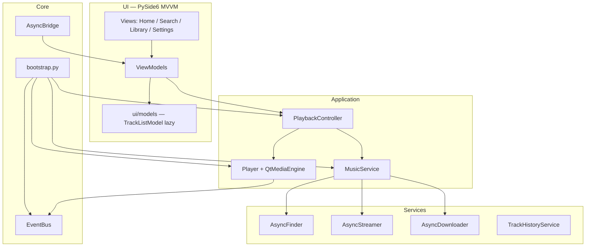

<p align="center">
  
</p>

<p align="center">
  <strong>Десктопный музыкальный плеер для RU/CIS</strong><br>
  Yandex Music · YouTube · Офлайн
</p>

<p align="center">
  <a href="https://www.python.org/"></a>
  <a href="LICENSE"></a>
  <a href="https://github.com/Really-Fun/Quantis"></a>
  <a href="https://github.com/Really-Fun/Quantis/releases"></a>
  
  
</p>

<p align="center">
  <a href="#-быстрый-старт">Быстрый старт</a> ·
  <a href="#-возможности">Возможности</a> ·
  <a href="#-темы">Темы</a> ·
  <a href="#-архитектура">Архитектура</a> ·
  <a href="#-разработка">Разработка</a> ·
  <a href="CONTRIBUTING.md">Contributing</a>
</p>

---

## О проекте

**Quantis** — асинхронный кроссплатформенный плеер на **PySide6** и **asyncio**.  
Один интерфейс для поиска и прослушивания музыки с **Яндекс.Музыки** и **YouTube**, скачивания треков, истории с возобновлением с места остановки и нативной интеграцией с ОС.

воспроизведение через **Qt Multimedia** (`QMediaPlayer`).

<table>
<tr>
<td width="50%" valign="top">

### Слушай

- Параллельный поиск Yandex + YouTube
- Стриминг и локальные файлы
- Resume position из SQLite
- Радио / рекомендации (YouTube Watch Playlist)

</td>
<td width="50%" valign="top">

### Управляй

- Скачивание треков и обложек
- Плейлисты «Недавно» и «Скачанные»
- SMTC (Windows) / MPRIS (Linux)
- 5 визуальных тем + редакционный UI

</td>
</tr>
</table>

---

## Возможности

| | |
|---|---|
| **Поиск** | Debounced-поиск, прогрессивная выдача по источникам, lazy-списки без прогрузки всего каталога сразу |
| **Воспроизведение** | Qt Multimedia, seek/volume, автопереход к следующему треку |
| **Офлайн** | Скачивание в `music/`, библиотека скачанного, статус на карточке трека |
| **История** | SQLite, недавно прослушанные, продолжение с сохранённой позиции |
| **Интерфейс** | MVVM, `EventBus`, кастомные QSS-темы, панель «Сейчас играет» |
| **Интеграция** | Медиа-клавиши ОС, keyring для токенов, расширяемость через плагины |
| **Архитектура** | `bootstrap.py` как composition root, DI без God Object |

---

## Темы

Пять готовых тем оформления — переключаются в **Настройки → Тема**:

| Тема | Характер |
|------|----------|
| **Неоновая** | Cyan + magenta, свечение, дефолт |
| **Редакционная** | Georgia + mono, cyan/red, панель «Сейчас» |
| **Классическая** | Спокойный тёмный steel-blue |
| **Светлая** | Приглушённый светлый режим |
| **Тёмно-жёлтая** | Тёплый amber-акцент |

---

## Быстрый старт

### Требования

- Python **3.13+**
- [Poetry](https://python-poetry.org/docs/#installation)
- Для Windows SMTC: пакеты `winrt-*` (ставятся автоматически через Poetry на Windows)

### Установка и запуск

```bash
git clone https://github.com/Really-Fun/Quantis.git
cd Quantis
poetry install
poetry run quantis
```

Альтернатива:

```bash
poetry run python -m quantis.main
```

### Yandex Music (опционально)

Без токена работает поиск и воспроизведение **YouTube**.  
Для **Яндекс.Музыки** добавь OAuth-токен — в приложении: **Настройки → Yandex Music**,  
или через keyring:

```python
import keyring

keyring.set_password("YANDEX_TOKEN_NEON_APP", "NEON_APP", "<ваш_oauth_токен>")
```

Другие записи keyring (для будущих интеграций): `LASTFM_API_NEON_APP`, `LASTFM_SECRET_NEON_APP`.

### Сборка exe (Windows)

```bat
poetry install --with dev
poetry run pyinstaller main.spec
```

Артефакты: `dist\Quantis\Quantis.exe`

---

## Архитектура



**Поток воспроизведения:** View → ViewModel → `PlaybackController` → `MusicService` / `Player` → `EventBus` → UI.

Слои разделены: виджеты не ходят в сеть напрямую, бизнес-логика — в `services/` и `controllers/`.

---

## Структура проекта

```text
src/quantis/
├── adapter/          # MPRIS (Linux), SMTC (Windows)
├── config/           # клиенты API, credentials, keyring
├── controllers/      # PlaybackController (медиатор)
├── core/             # bootstrap, AsyncBridge, PluginHost
├── database/         # SQLite, история прослушивания
├── models/           # Track, Playlist — чистые доменные модели
├── player/           # Player, QtMediaEngine
├── plugins/          # EventBus, базовый класс плагинов
├── providers/        # пути, плейлисты, TrackManager
├── services/         # поиск, стриминг, скачивание, рекомендации
├── styles/           # QSS-темы (classic, neon, editorial, …)
└── ui/
    ├── models/       # UI-модели (lazy TrackListModel)
    ├── viewmodels/   # Home, Search, Player VM
    └── views/        # страницы, player bar, виджеты
```

---

## Разработка

```bash
# тесты (без сети + опционально @pytest.mark.network)
poetry run pytest tests/ -q

# линтеры
poetry run ruff check src tests
poetry run black --check src tests
```

Отключить системный адаптер при отладке:

```bash
set QUANTIS_ENABLE_ADAPTER=0
poetry run quantis
```

Подробнее — в [CONTRIBUTING.md](CONTRIBUTING.md).

---

## Дорожная карта

- [ ] Spotify / VK / SoundCloud
- [ ] Горячие клавиши (Space, Ctrl+←/→)
- [ ] Визуализатор
- [ ] Android-клиент
- [ ] Пользовательские темы и фоны

---

## Лицензия

[GNU GPL v3](LICENSE) · © [Really-Fun](https://github.com/Really-Fun)

<p align="center">
  <sub>Если Quantis полезен — поставь звезду на GitHub. Это правда помогает.</sub>
</p>
