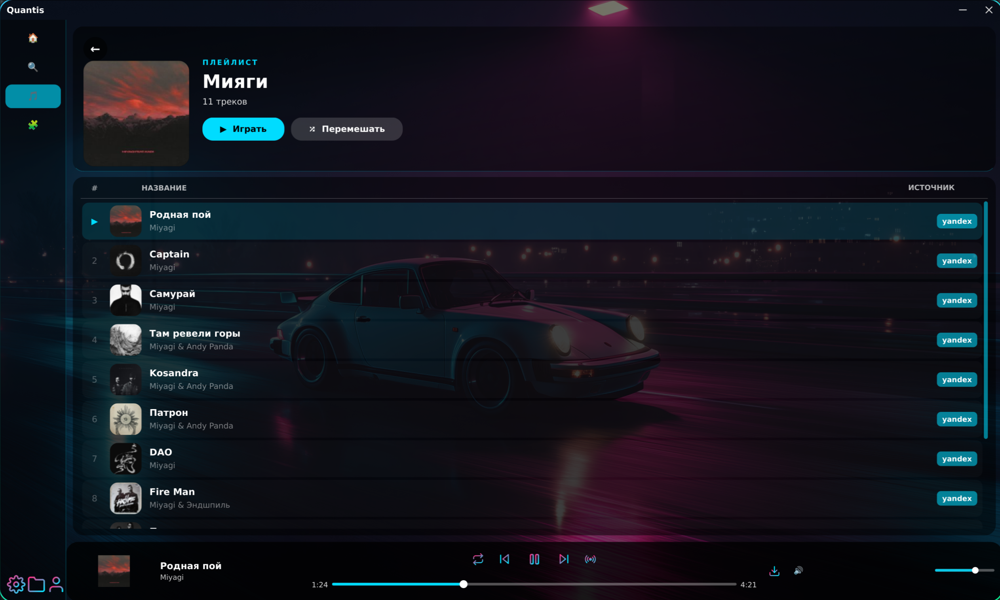
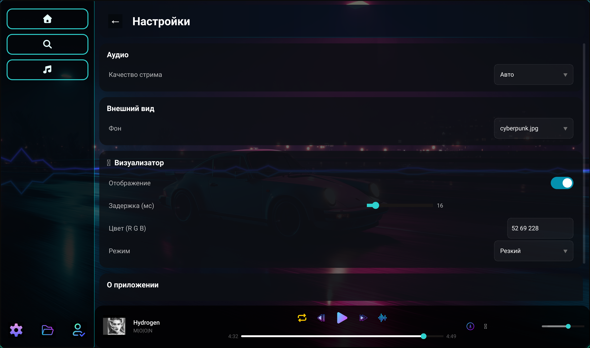
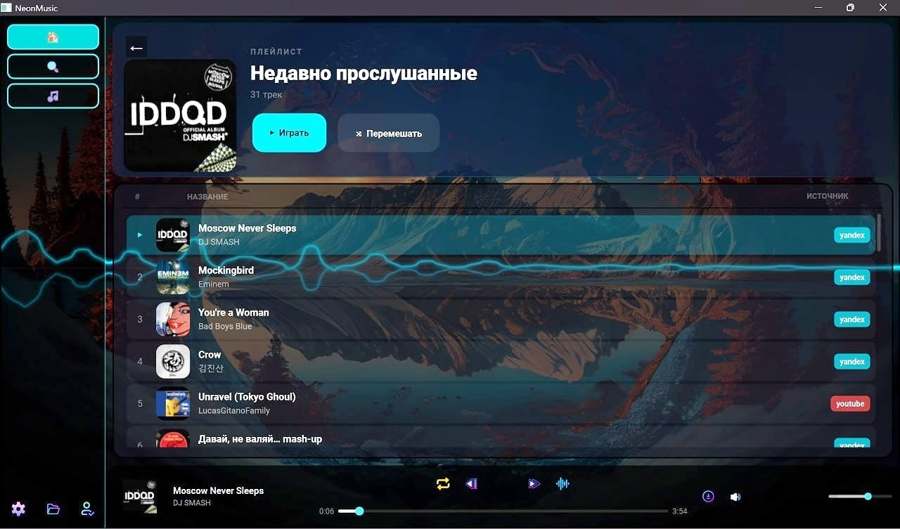

<p align="center">
  
</p>

<p align="center">
  
</p>

<p align="center">
  <a href="https://www.python.org/">
    
  </a>
  <a href="LICENSE">
    
  </a>
  <a href="https://github.com/Really-Fun/Quantis">
    
  </a>
  <a href="https://github.com/Really-Fun/Quantis">
    
  </a>
  <a href="https://github.com/Really-Fun/Quantis/releases">
    
  </a>
  <a href="https://github.com/Really-Fun/Quantis">
    
  </a>
</p>

> **Quantis** — быстрый кроссплатформенный десктопный плеер на `PySide6` и `asyncio`.  
> Обеспечивает поиск, стриминг, скачивание треков и ведение истории прослушивания, эквалайзер, система плагинов.
---

## Почему Quantis?

- Поиск треков из `Yandex` и `YouTube`.
- Система плагинов
- Стабильное воспроизведение через `VLC`.
- Скачивание треков + обложек.
- История прослушивания в `SQLite` с автосохранением позиции.
- Системные плейлисты: `Скачанные`, `Недавно прослушанные`.
- Настройки UI: фон и параметры визуализатора.
- Страница профиля (оффлайн, для загрузки токенов).
- Бесплатный (открытый исходный код)

---

## Стек

- Python `3.13+`
- `PySide6`, `qasync`, `python-vlc`
- `ytmusicapi`, `yt-dlp`, `yandex-music`
- `aiosqlite`

Полный список зависимостей — в `requirements.txt`.

---

## Быстрый старт

```bash
git clone https://github.com/Really-Fun/Quantis.git
cd Quantis
python -m venv .venv
source .venv/bin/activate  # Windows: .venv\Scripts\activate
pip install -r requirements.txt
python main.py
```

Требование!: установлен `VLC` в системе (для `python-vlc`).

### Сборка exe (Windows)

```bat
pip install pyinstaller
pyinstaller main.spec
```

Исполняемый файл и ресурсы появятся в `dist\Quantis\`. Запуск: `dist\Quantis\Quantis.exe`. В spec подключены локали **ytmusicapi** (в т.ч. RU) через `collect_all('ytmusicapi')`.

---

## Ключи и токены

Секреты берутся из системного `keyring`.

Используемые записи:

- `YANDEX_TOKEN_NEON_APP` (user: `NEON_APP`)
- `LASTFM_API_NEON_APP` (user: `NEON_APP`)
- `LASTFM_SECRET_NEON_APP` (user: `NEON_APP`)

Пример, как записать значения через Python:

```python
import keyring

keyring.set_password("YANDEX_TOKEN_NEON_APP", "NEON_APP", "<ваш_token>")
keyring.set_password("LASTFM_API_NEON_APP", "NEON_APP", "<ваш_api_key>")
keyring.set_password("LASTFM_SECRET_NEON_APP", "NEON_APP", "<ваш_api_secret>")
```

---

## Структура проекта

```text
config/      # инициализация внешних клиентов
database/    # SQLite + репозиторий истории
models/      # модели треков/плейлистов
player/      # воспроизведение и движок VLC
providers/   # менеджеры путей и плейлистов
services/    # поиск, стриминг, скачивание, история
ui/          # интерфейс и страницы приложения
utils/       # файловые и вспомогательные утилиты
```

---

## Интерфейс (скриншоты / GIF)

### Главная


### Поисковик


### Плейлист


### Настройки



### Обновленный вид (Update)




---

## Ближайший план

- Доработка сетевой диагностики и UX при ошибках соединения.
- Улучшенная оптимизация
- Рефакторинг и оптимизация кодовой базы
- Настройка пользовательской темы

---
